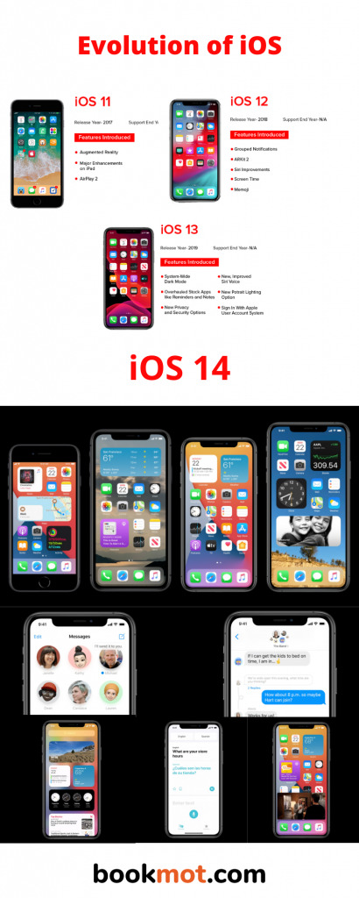
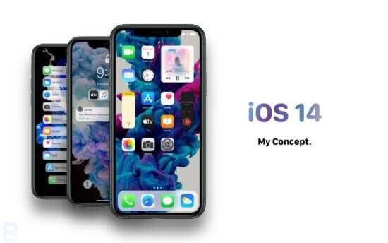

# final_site

<table style="width: 100%; border-collapse: collapse; height: 492px;" border="0">
<tbody>
<tr style="height: 271px;">
<td style="width: 17.2965%; height: 213px;"></td>
<td style="width: 82.7035%; height: 213px;">

&nbsp;The iOS is to the iPhone what Windows is to PCs or macOS is to Macs.

Apple's mobile operating system iOS runs the iPhone, iPad, and iPod Touch devices. Originally known as the iPhone OS, the name was changed with the introduction of the iPad.

It uses a multi-touch interface in which simple gestures operate the device, such as swiping your finger across the screen to move to the next page or pinching your fingers to zoom out.

There are more than 2 million iOS apps available for download in the Apple App Store, the most popular app store of any mobile device.

Unveiled in 2007 for the&nbsp;first-generation iPhone, iOS has since been extended to support other Apple devices such as the&nbsp;iPod Touch&nbsp;(September 2007) and the&nbsp;iPad&nbsp;(January 2010).

As of March&nbsp;2018, Apple's&nbsp;App Store&nbsp;contains more than 2.1&nbsp;million iOS applications, 1&nbsp;million of which are native for iPads.

&nbsp;These&nbsp;mobile apps&nbsp;have collectively been downloaded more than 130&nbsp;billion times. Major versions of iOS are released annually.

The current stable version,&nbsp;iOS 14, was released to the public on September 16, 2020.

It brought many user interface changes, including the ability to place widgets on the home screen, a compact UI for both Siri and phone calls, and the ability to change both the default web browser and email apps.

Now No devices were dropped, as all devices supported by&nbsp;iOS 13&nbsp;are able to run&nbsp;iOS 14.

<strong>How Much Does iOS Cost? How Often Is It Updated?</strong> 

Apple does not charge for updates to the operating system.

Apple also gives away two suites of software products with the purchase of iOS devices: The&nbsp;iWork suite of office apps&nbsp;&mdash; which includes a word processor, spreadsheet, and presentation software &mdash; and the iLife suite, which includes video-editing software, music-editing and creation software, and photo-editing software.&nbsp;

Apple apps&nbsp;like Safari, Mail, and Notes ship with the operating system by default.&nbsp; Apple&nbsp;releases a major update to iOS&nbsp;once a year&nbsp;with an announcement at Apple's developer conference in early summer.

It is followed by a release in early fall that is timed to coincide with the announcement of the most recent iPhone and iPad models.

These free releases add major features to the operating system. Apple also issues bug fix releases and security patches throughout the year.

</td>
</tr>
<tr style="height: 279px;">
<td style="width: 17.2965%; height: 279px;"></td>
<td style="width: 82.7035%; height: 279px;">

&nbsp;

<strong>How to Update Your Device to the Newest Version of iOS?</strong>

The easiest way to update your iPad, iPhone, or iPod Touch is to use the scheduling feature.

When a new update is released, the device asks if you want to update it at night.

Simply tap Install Later on the dialog box and remember to plug in your device before you go to bed.&nbsp;

You can also install the update manually by going into the device's settings, selecting General from the left-side menu and then selecting Software Update.

This menu takes you to a screen where you can download the update and install it on the device. The only requirement is that your device must have enough storage space to complete the process.

&nbsp;It brought many user interface changes, including the ability to place widgets on the home screen, a compact UI for both Siri and phone calls, and the ability to change both the default web browser and email apps.

Now No devices were dropped, as all devices supported by&nbsp;iOS 13&nbsp;are able to run&nbsp;iOS 14. How Much Does iOS Cost? How Often Is It Updated? Apple does not charge for updates to the operating system.

Apple also gives away two suites of software products with the purchase of iOS devices: The&nbsp;iWork suite of office apps&nbsp;&mdash; which includes a word processor, spreadsheet, and presentation software &mdash; and the iLife suite, which includes video-editing software, music-editing and creation software, and photo-editing software.&nbsp;

Apple apps&nbsp;like Safari, Mail, and Notes ship with the operating system by default.&nbsp; Apple&nbsp;releases a major update to iOS&nbsp;once a year&nbsp;with an announcement at Apple's developer conference in early summer.

It is followed by a release in early fall that is timed to coincide with the announcement of the most recent iPhone and iPad models.

These free releases add major features to the operating system. Apple also issues bug fix releases and security patches throughout the year.

How to&nbsp;Update Your Device to the Newest Version of iOS The easiest way to update your iPad, iPhone, or iPod Touch is to use the scheduling feature. When a new update is released, the device asks if you want to update it at night.

Simply tap&nbsp;Install Later&nbsp;on the dialog box and remember to plug in your device before you go to bed.&nbsp;

You can also install the update manually by&nbsp;going into the device's settings, selecting&nbsp;General&nbsp;from the left-side menu and then selecting&nbsp;Software Update.

This menu&nbsp;takes you to a screen where you can download the update and install it on the device.

The only requirement is that your device&nbsp;must have enough storage space&nbsp;to complete the process.

<strong>Market share</strong>

iOS is the second most popular mobile operating system in the world, after&nbsp;Android.

Sales of iPads in recent years are also behind Android, while, by web use (a proxy for all use), iPads (using iOS) are still the most popular.

By the middle of 2012, there were 410&nbsp;million devices activated.

At&nbsp;WWDC&nbsp;2014,&nbsp;Tim Cook&nbsp;said 800&nbsp;million devices had been sold by June 2014.

During Apple's quarterly earnings call in January 2015, the company announced that they had sold over one billion iOS devices since 2007.

By late 2011, iOS accounted for 60% of the market share for smartphones and tablets.

By the end of 2014, iOS accounted for 14.8% of the smartphone market&nbsp;and 27.6% of the tablet and two-in-one market.

In February 2015,&nbsp;Stat Counter&nbsp;reported iOS was used on 23.18% of smartphones and 66.25% of tablets worldwide, measured by internet usage instead of sales.

In the third quarter of 2015, research from Strategy Analytics showed that iOS adoption of the worldwide smartphone market was at a record low 12.1%, attributed to lackluster performance in China and Africa.

Android accounted for 87.5% of the market, with Windows Phone and BlackBerry accounting for the rest.

</td>
</tr>
</tbody>
</table>

<li></li>
gallery:

                        

